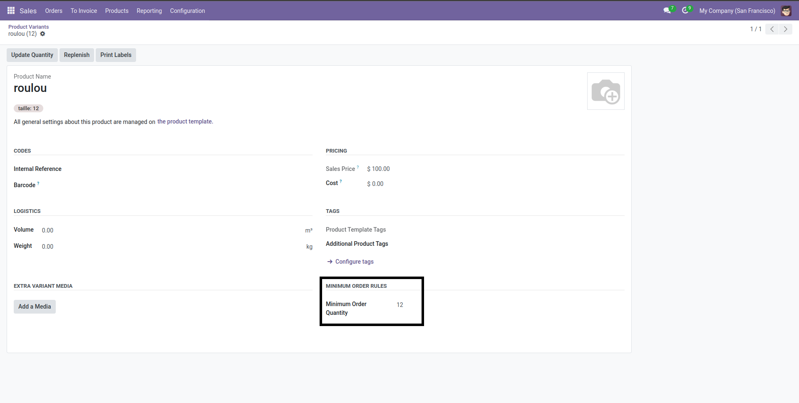
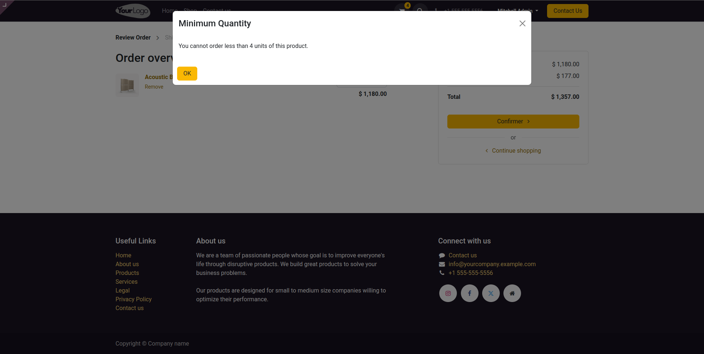

# Minimum Order Quantity (MOQ) for Products in Odoo Website

This module allows you to define a **Minimum Order Quantity** for each product or product variant.  
Customers will not be able to order quantities lower than the configured minimum in your online store.

---

## 📌 Configure Minimum Order Quantity

To set a minimum order quantity, open the product form:

- Go to **Sales → Products → Products**
- Open a product
- You will see the field **Minimum Order Quantity** under *General Information*

---

## 📌 Product Variants

If the product has variants, you need to set the minimum order quantity on the **variant form**:

- Go to the product
- Click on the **Variants** smart button
- Select a variant
- You will see the field **Minimum Order Quantity** under *Minimum Order Rules*

---

## 🛒 Website Shop Page

On the website, when viewing a product, the configured minimum order quantity will be displayed just below the quantity selector.  

For example: *"Minimum order quantity: 8"*

## Cart Quantity Restriction
This image demonstrates that in the cart, the user cannot choose a quantity below the Minimum Order Quantity (MOQ).

## Contact

If you have any questions, suggestions, or need support, feel free to contact me:

- Email: yousseftarhri14@gmail.com
- LinkedIn: https://www.linkedin.com/in/yousseftarhri
- Website/Portfolio: https://yousseftarhri.me